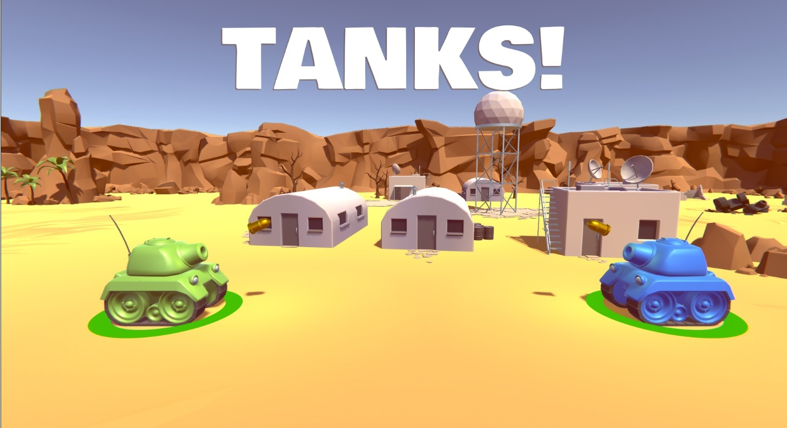

# Tanks! A multi-agent environment for ML-Agents
A multi-agent environment using Unity ML-Agents Toolkit where two agents compete in a 1vs1 tank fight game.

_______________________________________________________________
STATUS: Published, will have some minor updates.
_______________________________________________________________
## The Environment
- Two agents compete **in a 1 vs 1 tank fight game**.
- The goal is to **kill the opponent team while avoid being killed**.

### Observation Space
- Vector Observation space: 
    - **Bool canShoot** (you can only shoot a snowball every 2 seconds).
- Uses a One-Hot Grid Sensor.

### Agent Reward Function (dependant):
- (1 - accumulated time penalty): when you kill your opponent.
- (-1) When you're killed.

## How to use it 
- 1️⃣ Download the [ml-agents Release 12](https://github.com/Unity-Technologies/ml-agents/tree/release_12) NOT ABOVE THIS VERSION (because we use a modified version of the gridsensor that's compatible with only MLAgents Extensions 0.0.1).
- 2️⃣ Clone this Tank repository.
### On ML-Agents
- 3️⃣ Put the `Tank.yaml` file to your ML-Agents folder into `.\config\ppo`.
### On Unity
- 4️ Open the Unity Project `Project` in ML-Agents repo.
- 5️ Import package > Custom package `Tank.unitypackage` file.
- Enable the built in package 'Particle System' and 'Audio' in the Package Manager if you have some Audio and Particle errors.
- 6️⃣ 
 
### If you want to train
2 scenes:
- `Train_NonRandomGeneration`: Always the same environment (no random moving of the assets).
- `Train_RandomGeneration`: At each episode, the assets (trees, buildings) are placed randomly.
💡: A good idea, when you train, is to uncheck mesh render for all your assets, this way you can save computational power.

### If you want to play on Unity
In scenes open Play scene.

You can also [download the game on Itch.io](https://singularite.itch.io/tanks).

### Next Steps you can try
- Use MA-POCA, Multi Agent Posthumous Credit Assignment (a technique for cooperative behavior).
